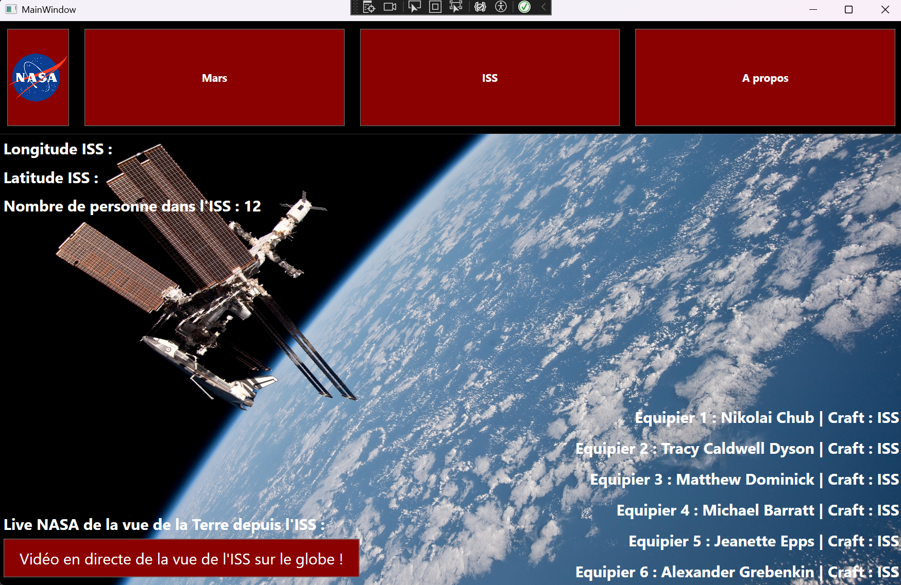
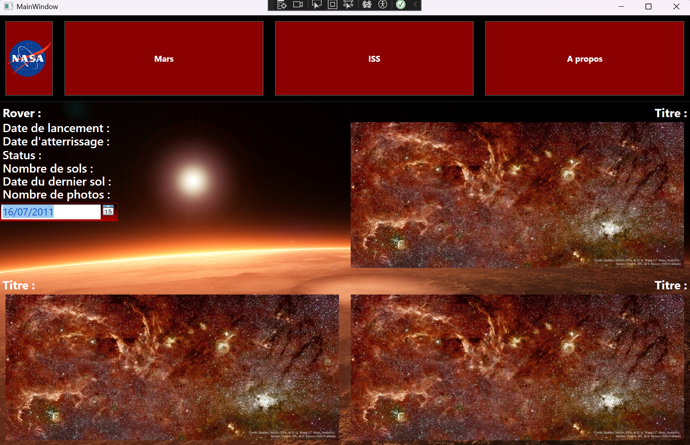
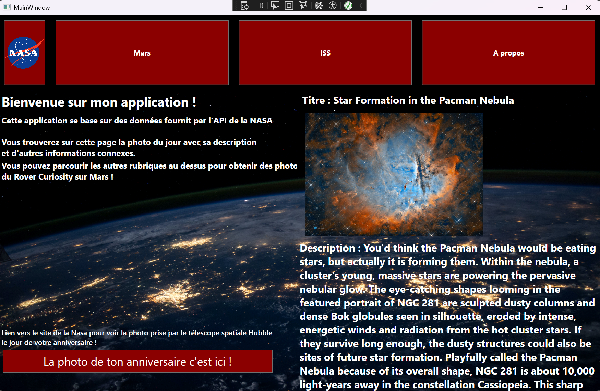

# 🚀 Application Spatiale WPF  

Une application développée en C# avec .NET WPF permettant d'afficher des données sur l'espace grâce à différentes API.  

## 🌌 Fonctionnalités  

- 📡 Affichage en temps réel de la position de l'ISS et des différentes informations la concernant (équipage)
- 🔭 Exploration de Mars avec les images des rovers de la NASA en fonction de la date choisis
- 📅 Accès aux événements spatiaux et aux prochaines mission
- 📊 Possibilité d'accéder aux photos prise par Hubble pour connaitre la photo prise le jour de votre anniversaire

## 🛠 Technologies utilisées  

- C#  
- .NET WPF  
- API NASA (APOD, Mars Rover, ISS Location, etc.)  
- OpenWeatherMap (pour la météo spatiale)  

## 📸 Aperçu  

### 🛰️ Position de l'ISS  
  

### 🔴 Exploration de Mars  
  

### 🌍 Menu principal  
  

## 📝 Auteur  

- **Coene Alexandre** - [GitHub](https://github.com/AlexandreCoene)  
